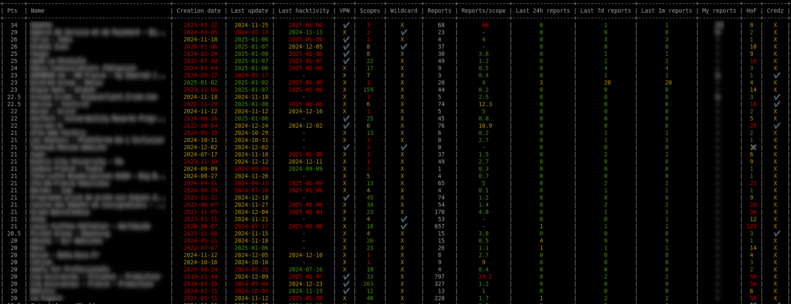
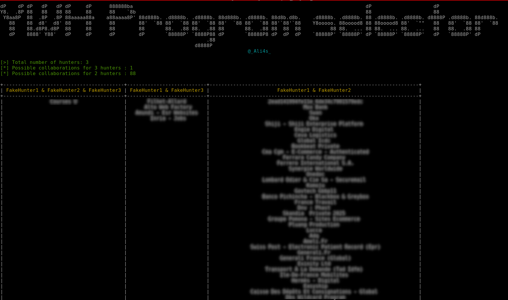

# YWH programs selector

## Description
This tool analyzes your YesWeHack private programs and reports, then prioritizes available programs to identify optimal targets for your next hunt.

The scoring algorithm assigns points to programs based on strategic criteria:
* Recently updated programs receive higher scores than older ones
* Programs with fewer reports are prioritized over heavily reported ones
* Programs offering wildcard scopes rank higher than single-URL targets
* ... and more

All configuration values can be customized to align with your hunting preferences and strategy.

Additionally, the tool enables program comparison with other hunters, facilitating the identification of promising collaborations!

You can also extract all your program scopes in one place to spray payloads.

Authentication can be fully automated or provided manually by a bearer.


## Usage

### Setup
```bash
$> pip install -r requirements.txt
```

If you want to fully automate the authentication part, you will be asked to provide your username/email, your password and your TOTP secret key.

All credential are stored locally in `$HOME/.config/ywh_program_selector/credentials`.

**How to obtain my TOTP secret key?**  
This data is only displayed once when you set up your OTP authentication from the YWH website.
If you have not noted it previously, you must deactivate and reactivate your MFA options.


### Options

```bash
usage: ywh_program_selector.py [-h] [--silent] (--token TOKEN | --local-auth | --no-auth) (--show | --collab-export-ids | --collaborations | --get-progs | --extract-scopes) [--ids-files IDS_FILES] [--program PROGRAM]

Retrieve all your YesWeHack private info in one place.

options:
  -h, --help               Show this help message and exit
  --silent                 Do not print banner
  --force-refresh          Force data refresh
  --token TOKEN            Use the YesWeHack authorization bearer for auth
  --local-auth             Use local credentials for auth
  --no-auth                Do not authenticate to YWH
  --show                   Display all programs info
  --collab-export-ids      Export all programs collaboration ids
  --collaborations         Show collaboration programs with other hunters
  --get-progs              Displays programs simple list with slugs
  --extract-scopes         Extract program scopes
  --ids-files IDS_FILES    Comma separated list of paths to other hunter IDs. Ex. user1.json,user2.json
  --program PROGRAM        Program slug

```

<u>**Export your private program info into a nice table**</u>
```bash
$> python ywh_program_selector.py [--token <YWH_TOKEN>] [--local-auth] --show
```



<u>**Export your private program collaboration ids**</u>
```bash
$> python ywh_program_selector.py [--token <YWH_TOKEN>] [--local-auth] --collab-export-ids > my-ids.json
```

<u>**Check your private programs in common with others hunters**</u>
```bash
$> python ywh_program_selector.py [--token <YWH_TOKEN>] [--local-auth] --collaborations --ids-files "my-ids.json, hunter1-ids.json, hunter2-ids.json"
```


<u>**Display programs list with slugs**</u>
```bash
$> python ywh_program_selector.py [--token <YWH_TOKEN>] [--local-auth] --get-progs
```

<u>**Extract your private scopes into files**</u>
```bash
$> python ywh_program_selector.py [--token <YWH_TOKEN>] [--local-auth] --extract-scopes
```

<u>**Extract your private scopes into files for one program**</u>
```bash
$> python ywh_program_selector.py [--token <YWH_TOKEN>] [--local-auth] --extract-scopes --program <PROG_SLUG>
```

## TODO
* Use multithreading to speed up the data fetching
* Extract all points values in config to allow fine tuning