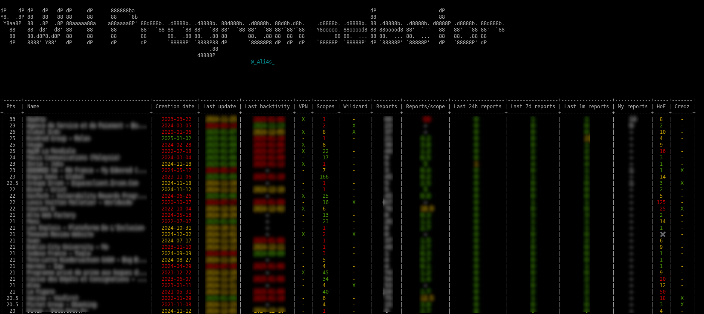

# YWH programs selector

## Description
This script retrieves your YesWeHack private programs and reports then it sorts your available programs to highlight your next favorite targets.

Feel free to customize all the config values to make the results meet your needs.

## Usage

### Setup
```bash
pip install -r requirements.txt
```

### Config
Update the variables in lines 1 & 2 inside config.py
```python
YWH_USERNAME = "" # TO CHANGE
YWH_BEARER = "" # TO CHANGE
```

`YWH_USERNAME` is your YesWeHack username.  
`YWH_BEARER` is your YesWeHack authorization bearer.

### Run

```bash
python main.py
```



## TODO
* Use multithreading to speed up the data fetching ?
* Implement a login/password/otp authentication ?
* Extract all points values in config to allow fine tuning